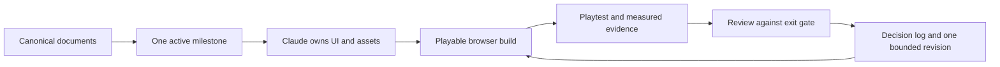

# Claude Code handoff

## Principle

Canonical context lives in the repository. Prompts stay short and name the
desired outcome. This lets Claude exercise its own design and implementation
judgment without losing the product truth.

Claude owns:

- Player-facing UI and UX
- Visual presentation
- Asset direction, selection, creation, and integration
- Visual and asset validation for the active milestone

Canonical project ownership remains with:

- Player fantasy and verbs
- Game rules and progression
- World structure
- Architecture contracts
- Active milestone scope
- Legal, paid-service, credential, and publishing approval

Claude may connect UI and assets to stable game contracts. A proposed mechanic,
scope, legal, or architecture change is surfaced as a product conflict rather
than silently implemented.

## Deterministic handoff loop



Each loop contains one milestone and one evidence-backed revision pass. Do not
send Claude a combined backlog of unrelated future systems.

## Prompt: UI/UX and visual ownership

Copy this when the active milestone has a playable UI boundary:

```text
You are taking ownership of all player-facing UI/UX and visual presentation
for Longride.

Read CLAUDE.md and the canonical project documents it links before making
decisions. The active milestone in docs/MILESTONES.md defines the current scope
and its exit gate defines success.

This is a third-person browser experience in which the player is a young wild
horse exploring an island. The horse, landscape, movement, and sense of
discovery should remain the center of attention.

Own the design direction and implementation decisions. We are deliberately not
prescribing layouts, components, styling methods, or visual techniques because
we want your judgment. Preserve the established gameplay and technical
boundaries. Surface only conflicts that materially change product identity,
mechanics, milestone scope, legal position, or require a paid external service.

Leave the active milestone playable and validated against its exit gate. Record
important durable choices in docs/DECISIONS.md.
```

## Prompt: asset ownership

Copy this when the active milestone needs real visual or audio assets:

```text
Take ownership of the visual and audio assets and their integration for the
current Longride milestone.

Read CLAUDE.md, docs/ART_ASSET_BRIEF.md, docs/WORLD_BIBLE.md,
docs/TECHNICAL_ARCHITECTURE.md, and the active milestone before proceeding.

The desired result is a coherent island exploration experience in which the
horse, terrain, landmarks, wildlife, environmental elements, and sound feel
like one world and remain readable during movement. You have autonomy over the
asset direction, sources, creation approach, and integration.

Treat gameplay readability, browser performance, provenance, and usage rights
as hard constraints. Record every external or generated asset in
docs/ASSET_PROVENANCE.md. Surface only a product-identity conflict, legal
uncertainty, paid external service, or change to established mechanics or
scope.

Leave the active milestone playable and validate the result against its exit
gate.
```

## Prompt: evidence-led iteration

Copy this after a playtest or visual review:

```text
Review the current playable Longride build against the canonical project
documents and the active milestone exit gate.

Review evidence:
- [playtest observations]
- [screenshots or recording]
- [measured performance]
- [moments where the experience was unclear, weak, or inconsistent]

Treat these as observed problems, not prescribed solutions. Decide and carry
through the highest-leverage UI, visual, and asset changes while preserving
established mechanics and scope. Record durable decisions or intentional
tradeoffs in docs/DECISIONS.md, update docs/ASSET_PROVENANCE.md when relevant,
and verify the resulting player experience against the milestone gate.
```

Good evidence:

> At full gallop I repeatedly lost the destination silhouette, and I could not
> tell whether the first herd trace had completed.

Prescriptive feedback to avoid:

> Add a compass at the top and a green confirmation toast.

The first communicates the problem and preserves Claude's ownership of the
solution.

## Approval boundaries

Claude pauses before:

- Adding a paid API, paid asset, account dependency, or recurring service
- Publishing or externally distributing a build or asset
- Using an asset with uncertain redistribution rights
- Changing the player fantasy, game rules, progression, or milestone scope
- Weakening typed simulation/UI boundaries for presentation convenience
- Adding secrets, credentials, or private data to project files
- Making destructive changes unrelated to the active milestone

## Handoff evidence

A completed handoff should leave:

- A playable active milestone
- Verification against the milestone exit gate
- Important durable decisions recorded
- Asset provenance updated
- Known limitations stated honestly
- No unrelated future scope silently introduced

