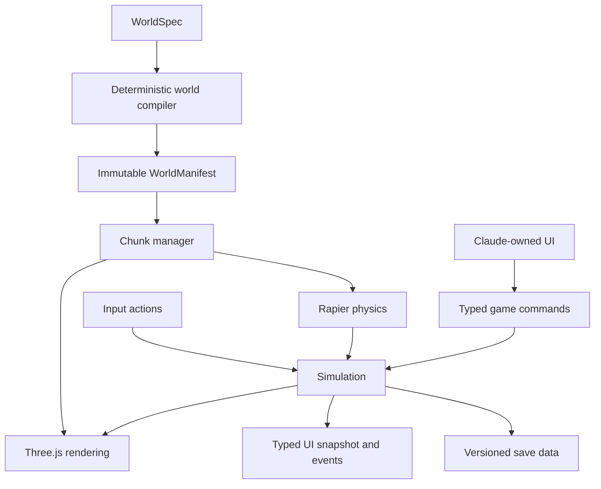

# Technical architecture

## Architecture statement

Windhoof is a deterministic finite-island compiler feeding a separate
Three.js/Rapier game runtime. It is not an infinite sandbox, scene editor, or
monolithic Three.js scene containing game logic.

The compiler is the executable counterpart of the structured planning and
global-terrain stages in the WorldClaw-derived production method. The renderer
then provides canonical views for regional render-inspect-refine loops. See
[WORLDCLAW_WEB_METHOD.md](WORLDCLAW_WEB_METHOD.md).

## Initial stack

- TypeScript
- Vite
- Three.js with stable WebGL 2 renderer first
- Rapier 3D WASM for collision and fixed-step physics
- Web Workers for world compilation or preparation when beneficial
- IndexedDB behind a save adapter
- JSON Schema for source world specifications
- Player-facing UI behind typed contracts; its implementation stack is owned
  by Claude Code
- Automated browser checks in Chromium and WebKit

WebGPU remains an enhancement after the base WebGL 2 build meets performance
and compatibility gates.

## State ownership



- Simulation owns horse state, discovery state, progression, safe reset, and
  saveable truth.
- Rapier resolves collision and movement queries.
- Three.js visualizes interpolated state.
- UI reads typed snapshots/events and sends typed commands.
- Saves contain serializable simulation state only.

Three.js objects, Rapier handles, UI components, loaded chunks, and animations
must never become competing sources of gameplay truth.

## Horse controller

The horse uses a purpose-built kinematic controller rather than a physically
simulated quadruped.

- Position-based kinematic Rapier body
- Simplified upright capsule collider
- Separate visual horse root
- Fixed simulation step at 60 Hz
- Interpolated render snapshots
- Gait state driven by controller speed and intent
- Grounding, slopes, autostep, collision, and jump handled explicitly

The capsule is intentionally less anatomically accurate than the visible
horse. A compound four-leg collider would snag on scenery and make a pleasant
controller much harder to achieve.

```ts
interface HorseState {
  position: Vec3;
  yaw: number;
  speed: number;
  verticalVelocity: number;
  gait: "idle" | "walk" | "trot" | "canter" | "gallop";
  grounded: boolean;
  lastGroundedTick: number;
  lastSafePose: SafePose;
}
```

Fixed-tick movement sequence:

1. Read latched actions.
2. Convert input into camera-relative travel intent.
3. Select target gait and speed.
4. Apply acceleration, braking, and gait-dependent turn rate.
5. Apply jump velocity or gravity.
6. Ask Rapier to correct intended translation.
7. Apply the corrected position and independent yaw.
8. Update grounding, safe pose, gait, and discovery triggers.
9. Publish render state and game events.

## Camera

The chase camera uses a spring-arm model with obstruction checks.

- Approximate starting distance: 6-7 metres
- Target near upper body
- Controlled yaw and bounded pitch
- Velocity look-ahead
- Slow auto-alignment
- Small speed-based FOV response
- Shape or sphere cast against world collision
- Fast movement inward on obstruction, smooth return outward

Camera smoothing state is not authoritative and normally is not saved.

## Island and chunks

Starting compiler values:

- Bounds: 1,024 x 1,024 metres for the first complete island experiment
- Chunks: 128 x 128 metres
- Grid: 8 x 8
- Terrain: 65 samples per edge, producing two-metre cells
- World convention: one Three.js/Rapier unit equals one metre

Runtime rings:

- Near 3 x 3: full visuals, physics, discoveries, and detailed placement
- Middle 5 x 5: terrain and reduced-detail visual content
- Far: low-detail island silhouette without physics

At gallop speed, prefetch looks ahead along velocity. A chunk collider must be
ready before the horse can enter that chunk.

Chunk lifecycle:

```text
absent -> requested -> prepared -> active -> cooldown -> disposed
```

Key rules:

- Terrain samples use global coordinates.
- Adjacent chunks share identical border samples.
- Activation work is spread across frames.
- Unload distance uses hysteresis.
- Repeated vegetation and rocks are instanced.
- Geometry, materials, and textures are explicitly disposed when no longer
  referenced.

The vertical slice may keep all terrain active. Streaming is introduced only
after horse feel and deterministic terrain are working.

## Save boundary

```ts
interface GameSaveV1 {
  saveVersion: 1;
  worldId: string;
  worldSeed: number;
  generatorVersion: string;
  manifestHash: string;
  lastSafePose: SafePose;
  discoveryStates: Record<string, DiscoveryState>;
  playTimeTicks: number;
}
```

Do not persist renderer objects, Rapier objects, loaded chunks, animation time,
PRNG cursor, mid-air velocity, or camera smoothing state.

A manifest mismatch must be handled explicitly and never silently load a save
into changed terrain.

## UI boundary

The UI implementation imports only stable contracts:

- `UiSnapshot` - readable current state
- `GameEvent` - meaningful state changes
- `GameCommand` - permitted player-facing commands

UI code must not mutate Three.js scene objects, call Rapier directly, or become
the owner of discoveries. This boundary preserves Claude's freedom to redesign
the presentation without destabilizing simulation.

WebGL lifecycle is also outside simulation truth. A small runtime state machine
pauses the fixed-step world, clears input, requests a safe save, and smoke-renders
retained resources after restoration. Presentation receives typed status and
events, but only an explicit Resume may restart simulation after recovery. See
[the Milestone 5 backend contract](contracts/MILESTONE_5_BACKEND_CONTRACT.md).

## Proposed module layout

```text
src/
  app/
    bootstrap.ts
    gameLoop.ts
  game/
    contracts/
      worldSpec.ts
      worldManifest.ts
      gameEvents.ts
      uiContract.ts
      saveSchema.ts
    simulation/
      fixedStep.ts
      gameState.ts
      horse/
      discoveries/
    world/
      compiler/
      runtime/
    input/
    save/
  physics/
  render/
    app/
    camera/
    horse/
    world/
    adapters/
    resources/
  workers/
  diagnostics/
  ui/                 # Claude-owned implementation
tests/
  unit/
  generation/
  simulation/
  browser/
  performance/
```

No ECS, monorepo, or generic event framework is needed at project start. The
UI framework choice belongs to Claude Code and must remain behind the typed UI
boundary.

## Provisional desktop performance gates

Measured at 1080p with device pixel ratio capped near 1.5:

- 60 FPS target
- Physics p95 below 2 ms
- Chunk activation amortized below 2 ms per frame
- No chunk-loading main-thread task above 50 ms
- Under 200 steady-state draw calls; 300 absolute peak
- Under roughly 750k visible triangles normally; 1.2M peak
- Under roughly 256 MB estimated texture residency
- Under 250 MB JavaScript heap after warmup
- No sustained growth after repeated chunk cycling
- Under 20 MB initial compressed download, with later world content streamed
- No post-processing until the base scene meets budget

These are starting enforcement targets, not claims about an unbuilt game. The
M4 development machine is too forgiving to serve as the only target device.

## Essential automated checks

- Known-answer tests for seeded random streams
- Same WorldSpec produces the same manifest hash
- Shared terrain borders are byte-identical
- Stable IDs do not depend on generation or loading order
- No NaN or out-of-island placements
- Spawn is grounded, clear, and reachable
- Every mandatory discovery is reachable on horse-traversable terrain
- Recorded action input produces expected horse-state snapshots
- Horse respects slope and airborne-jump rules
- Camera obstruction avoids clipping
- Chunk collider is active before entry
- Gallop cannot cross unloaded physics
- Repeated island circuits do not leak resources
- Save round-trip and migration checks
- Chromium and WebKit smoke journeys
- No console errors or unhandled promises on the standard journey

## Main technical risks

- Good movement with poor animation can still look wrong.
- Procedural terrain can be attractive but unrideable.
- Fast galloping exposes streaming earlier than walking games.
- Chunk seams can break visuals and physics simultaneously.
- External generated assets may not form one compatible animation family.
- Generator changes can invalidate saves.
- “Open world” can turn into a scope excuse.

Each risk has an explicit milestone gate in [MILESTONES.md](MILESTONES.md).
