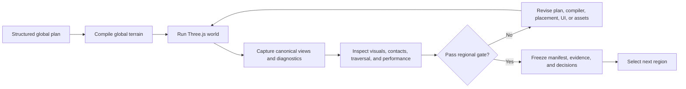

# WorldClaw method adapted for Longride

## Commitment

Longride follows WorldClaw's published coarse-to-fine, global-to-regional
construction method. It does not claim to run Tencent's unreleased WorldClaw
implementation.

The adaptation preserves the method's essential properties:

- Convert high-level intent into a shared structured world specification.
- Establish global terrain, regions, materials, routes, and scale before local
  decoration.
- Realize detailed content selectively, one region at a time.
- Keep terrain and every important object explicit and independently editable.
- Render, inspect, test, and refine the executable world in repeated loops.

Three.js replaces Blender as the executable scene and inspection environment.
Rapier supplies the collision and traversal layer required by an actual game.
The browser build, screenshots, diagnostics, and playtests replace Blender
render inspection.

## Stage 1 - Intent analysis and scene planning

Input:

- Product vision
- Horse fantasy and verbs
- Island premise and tone
- Browser and performance constraints

Output:

- Validated `WorldSpec`
- Region graph and spatial relationships
- Terrain, material, atmosphere, object-category, and density intentions
- Required horse routes and discovery relationships
- Global art and gameplay constraints shared by all later stages

Intent extraction and creative completion remain separate. Confirmed owner
requirements are never silently replaced by generated assumptions. Any
necessary completion is explicit and recorded as a provisional decision.

## Stage 2 - Global terrain foundation

The compiler turns the structured plan into inspectable intermediate data:

- Semantic region layout
- Coastline and global height field
- Slope, moisture, shore-distance, and traversability fields
- Region materials and terrain-associated reusable scatter families
- Required routes, safe spawn, resting hollows, and landmark anchors
- Stable IDs, chunk records, and manifest hash

This stage establishes the entire island's geometry and spatial semantics
before detailed regional object work. Its output must already be traversable
and globally coherent with placeholder content.

Terrain refinement uses both render evidence and gameplay evidence. A terrain
that looks attractive but fails gallop, slope, jump, camera, or reachability
tests does not pass.

## Stage 3 - Regional object generation and placement

Only regions that need more detail are realized. For each selected region:

1. Render canonical overview and riding-height views from the current terrain.
2. Combine the global world context, region specification, terrain evidence,
   gameplay role, and browser budget into one regional brief.
3. Let Claude Code own the visual composition and asset strategy.
4. Integrate explicit assets as independently manageable instances with stable
   IDs and transforms.
5. Validate scale, pose, contact, collision proxy, visibility, provenance, and
   performance.
6. Preserve the established terrain, route graph, and neighboring-region
   constraints while revising local detail.

Generated or sourced assets are accepted only when they fit the canonical
world, asset family, browser budgets, and redistribution requirements. Images
or concept compositions are planning evidence, never runtime geometry by
themselves.

## Agentic render-inspect-refine loop



Each inspection covers two distinct layers:

- **World correctness:** terrain continuity, route reachability, object contact,
  collision, stable placement, asset independence, and manifest determinism.
- **Player experience:** horse readability, navigational cues, landmark
  silhouettes, camera behavior, discovery comprehension, frame time, and UI
  restraint.

Claude Code owns every player-facing UI, visual-composition, and asset revision
inside the same persistent session. Codex owns the structured contracts,
compiler, simulation, physics, automated checks, and final gate verification.

## Explicit representation

The runtime world is composed from:

```text
World = global terrain
      + explicit region/material records
      + independent asset instances
      + explicit transforms and collision proxies
      + simulation and discovery records
```

Do not flatten a region into a backdrop, bake interactive objects into one
opaque mesh, or let screenshots become source-of-truth content. Important
objects must remain addressable, movable, replaceable, optimizable, and
testable.

## Difference between world production and game development

WorldClaw's public method produces static explicit scenes. Longride adds the
systems it does not provide:

- Horse locomotion and animation state
- Third-person camera and input
- Rapier collision and safe recovery
- Discovery progression and saves
- Browser streaming and resource disposal
- UI and accessibility contracts
- Automated traversal and browser playtests

The WorldClaw stages govern how the island is constructed. Longride's milestone
gates govern when that island is playable enough to expand.

