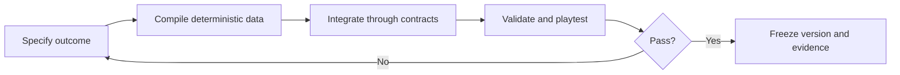

# Deterministic world pipeline

## Purpose

WorldClaw's useful idea is global planning followed by selective regional
realization. Windhoof adopts that production pattern without Blender or an
unreleased generation stack. The exact method mapping is canonicalized in
[WORLDCLAW_WEB_METHOD.md](WORLDCLAW_WEB_METHOD.md).

The result is a web-native world compiler whose source is readable data and
whose output is stable, validated game content.

The WorldClaw-derived construction order is not optional:

1. Intent analysis and structured scene planning
2. Global semantic terrain foundation
3. Selective regional object generation and placement
4. Repeated render-inspect-refine passes throughout stages 2 and 3

The five-stage feature loop below runs inside that construction order. It does
not replace it.

## Source and output

```text
WorldSpec (editable, reviewed)
    -> WorldManifest (immutable compiled truth)
    -> Chunk payloads (terrain and placements)
    -> Three.js/Rapier runtime
```

The source specification describes intention. The manifest records exactly
what the runtime will use. Generated chunk output is never hand-edited.

## The five-stage loop

Every world feature and every region uses the same loop.

### 1. Specify

Define one player-visible outcome and its acceptance criteria.

Examples:

- The opening plain provides a safe uninterrupted ten-second gallop.
- The first herd trace can be found using tracks and a distant call.
- The forest offers a safer winding path and a faster jump route.

Update the typed WorldSpec or canonical design documents. Do not begin by
placing attractive props.

### 2. Compile

Generate deterministic data:

- Island mask and coastline
- Height and slope fields
- Moisture and biome weights
- Traversability and required connections
- Spawn and safe poses
- Landmark and discovery records
- Environmental placements
- Stable IDs and manifest hash

Compilation has no dependency on frame timing, current camera, or chunk-load
order.

### 3. Integrate

Connect compiled records to existing boundaries:

- Simulation for discoveries and progression
- Rapier for terrain and obstacle collision
- Three.js for terrain and visual instances
- Typed snapshots/events for Claude-owned presentation

Integration must not create a second source of truth.

### 4. Validate

Run deterministic, traversal, streaming, save, and performance checks, then
play the result.

Automated validation proves structural correctness. Playtesting decides
whether crossing the space is enjoyable and legible.

### 5. Freeze or revise

If the feature passes:

- Record the generator version.
- Record the manifest hash.
- Record the decision and evidence.

If it fails, change the specification or compiler and repeat from stage one.
Do not patch generated output until the current seed merely looks acceptable.



## Determinism rules

- Never use `Math.random()`, current time, insertion timing, or load order.
- Each stage and chunk receives an independent seeded random stream.
- Terrain is evaluated in global coordinates.
- Quantize height, position, rotation, and scale before hashing.
- Sort generated records by stable ID.
- Pin generator, noise, Three.js, and Rapier versions.
- Increment `generatorVersion` when compiled results may change.
- Saves record both generator version and manifest hash.

Stable feature IDs derive from:

```text
world seed
+ generator version
+ stage
+ chunk coordinate
+ feature type
+ feature index
```

Exact replay of dynamic physics across every browser is not a first-release
goal. Exact world compilation is.

## Compiler stages

1. Validate WorldSpec structure and cross-references.
2. Create deterministic random streams.
3. Generate global island mask and height field.
4. Derive slope, shore distance, moisture, and region weights.
5. Establish mandatory routes and test their terrain envelopes.
6. Select safe spawn and resting poses.
7. Place authored discoveries using stable region constraints.
8. Scatter optional environmental content using slope, density, exclusion,
   and visibility rules.
9. Partition records into chunks while retaining global IDs.
10. Validate, sort, quantize, hash, and write the manifest.

## WorldSpec contract

The frozen vertical-slice schema is
[world-spec.schema.json](contracts/world-spec.schema.json), with its source in
[world-spec.example.json](contracts/world-spec.example.json). The additive
first-island schema is
[world-spec-v4.schema.json](contracts/world-spec-v4.schema.json), with its
separate source in
[world-spec.first-island.json](contracts/world-spec.first-island.json).

Schema v4 does not infer a world graph from JSON order, IDs, or visual tags. It
authors the coastal cycle, central highland, safe and expressive route roles,
route control points, and broad regional terrain intent as executable source
truth. The full contract is
[MILESTONE_5_BACKEND_CONTRACT.md](contracts/MILESTONE_5_BACKEND_CONTRACT.md).

Schema validation alone cannot prove:

- Region IDs referenced elsewhere exist.
- Mandatory paths are reachable.
- Terrain is safe for the horse.
- Two discoveries overlap.
- A signal is visible or audible from its intended approach.

Those are compiler validation responsibilities.

## Regional refinement

A region is considered complete only when:

- Its gameplay purpose is stated.
- Entry and exit routes connect to the global traversal graph.
- At least one memorable silhouette or sound anchors orientation.
- Mandatory terrain is horse-traversable.
- Props respect route and discovery exclusion zones.
- The region remains readable at its intended gait.
- Its content meets the active performance budget.
- The same source produces the same manifest hash.

Add one region, validate it, play it, and freeze it before expanding further.

## Claude Code iteration boundary

World and game truth live in canonical documents and compiled contracts.
Claude owns UI, presentation, and assets. Each handoff supplies:

- The active milestone
- The relevant canonical context
- Player-visible acceptance criteria
- Measured or observed evidence

Feedback describes observed problems rather than prescribing Claude's visual
solution. The bounded handoff loop is documented in
[CLAUDE_CODE_HANDOFF.md](CLAUDE_CODE_HANDOFF.md).
